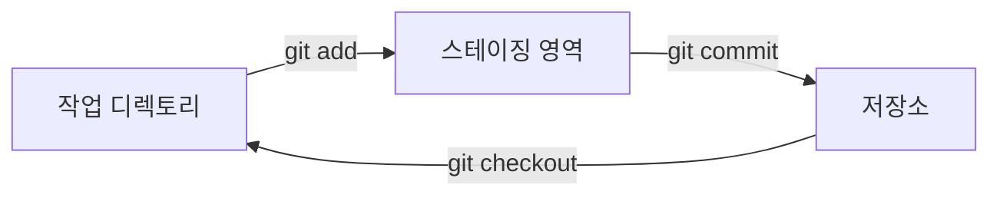

## 단계 2: 첫 번째 저장소 만들기

샘플 프로젝트를 살펴보고 Git에 사용자 정보를 알려줬으니, 이제 게임을 버전 관리에 등록해 봅시다!

### 📖 이론: Git 워크플로우

Git 워크플로우는 세 가지 주요 영역으로 구성됩니다:

- **작업 디렉토리(Working Directory)**: 변경 사항을 만드는 프로젝트 파일이 있는 곳입니다.
- **스테이징 영역(Staging Area, Index)**: 히스토리에 저장하고 싶은 변경 사항을 그룹화하는 준비 영역입니다.
- **저장소(Repository)**: 프로젝트 개발 히스토리의 영구 기록입니다.



### 중요한 Git 명령어는 무엇인가요?

Git에는 많은 작업이 있지만, 로컬 프로젝트에서 가장 많이 사용하는 몇 가지가 있습니다.

- `git init` - 버전 관리를 활성화하기 위해 새 저장소를 시작합니다.
- `git add` - 관련된 변경 사항을 스테이징 영역에 그룹화하여 히스토리에 "커밋"할 준비를 합니다.
- `git commit` - 스테이징 영역의 변경 사항을 프로젝트 히스토리에 저장하거나 "커밋"합니다.
  - 커밋 메시지 - 히스토리를 체계적으로 유지하기 위한 변경 사항에 대한 짧은 설명입니다.
- `git status` - 작업 디렉토리와 스테이징 영역의 현재 상태를 봅니다.
- `git checkout` - 저장소 히스토리의 다른 버전으로 작업 디렉토리를 변경합니다.

> [!TIP]
> 커밋 메시지를 과소평가하지 마세요! 명확하고, 간결하고, 설명적이며, 일반적이지 않은 메시지는 프로젝트 히스토리를 훨씬 이해하기 쉽게 만들어 줍니다 (그리고 미래의 버그를 찾는 데도 도움이 됩니다)!

### ⌨️ 활동 1: 프로젝트 저장소 초기화하기 (CLI 사용)

게임에 버전 관리를 추가하고 현재 버전을 커밋해 봅시다.

1. 터미널에서 프로젝트 디렉토리로 이동합니다.

   ```bash
   cd /workspaces/stack-overflown
   ```

1. 새 Git 저장소를 초기화합니다.

   ```bash
   git init
   ```

1. 저장소 상태를 확인합니다. "No commits yet"이라고 표시되고 `git add`를 사용하라는 팁이 보입니다.

   ```bash
   git status
   ```

   

1. 게임 파일을 스테이징 영역으로 올립니다. 이렇게 하면 잠긴 복사본이 생성되어 저장소 히스토리에 커밋할 준비가 됩니다.

   ```bash
   git add src/index.html
   git add src/index.js
   git add src/patterns.js
   git add src/style.css
   ```

   또는

   ```bash
   git add src/*
   ```

1. 저장소 상태를 다시 확인합니다. 각 파일이 `new file`로 표시되는 것을 확인합니다.

   ```bash
   git status
   ```

   

1. 변경 사항을 저장소 히스토리에 커밋합니다. 프로젝트 히스토리가 시작되었습니다! :octocat:

   ```bash
   git commit -m "Initial commit"
   ```

   

1. 저장소 상태를 확인합니다. "working tree clean"이 표시되는데, 이는 현재 복사본이 히스토리와 완벽하게 일치한다는 의미입니다.

   ```bash
   git status
   ```

   

### ⌨️ 활동 2: 파일 작업하기 (VS Code 사용)

코드 에디터를 사용하여 파일을 추가해 봅시다. 이번에는 게임의 문서를 작성합니다.

1. 파일 탐색기에서 **New File...** 아이콘을 클릭하여 다음 이름으로 README 파일을 만듭니다. `stack-overflown/` 폴더 안에 있는지 확인하세요.

   ```txt
   README.md
   ```

   

1. 파일을 열고 다음 내용을 입력합니다.

   ```md
   # Stack Overflown

   Organize the falling blocks into the current debug pattern before the stack overflows! ⏳
   ```

1. 왼쪽 탐색에서 **Source Control** 탭을 선택합니다. `README.md` 파일이 **Changes** 영역에 표시되어 있는 것을 확인합니다.

   

1. 파일 위에 마우스를 올리고 플러스 `+` 버튼을 선택하여 스테이징 영역으로 올립니다.

   

1. 커밋 메시지를 입력하고 **Commit** 버튼을 누릅니다.

   ```txt
   Start game documentation
   ```

   

1. 두 번째 커밋을 위해 `README.md`에 다음 내용도 추가합니다.

   ```md
   ## How to Develop

   - `index.html` - the game container for playing
   - `index.js` - the primary game logic
   - `patterns.js` - the error patterns to match during gameplay
   - `style.css` - the game formatting and styling
   ```

1. 변경 사항을 스테이징으로 올리고 아래 메시지로 커밋합니다.

   ```txt
   Start developer docs
   ```

   

1. 새로운 커밋이 저장소에 추가되면, Mona가 이미 여러분의 작업을 확인하고 있을 것입니다. 잠시 기다리며 댓글을 확인하세요. 진행 상황과 다음 단계가 표시됩니다.

<details>
<summary>문제가 있나요? 🤷</summary><br/>

- `git status`에 잘못된 파일이 표시되면 `git restore --staged <filename>`으로 스테이징에서 제거할 수 있습니다.

</details>
