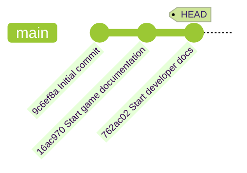

## 단계 3: Git 히스토리 탐색

게임이 Git에서 추적되고 있으니, 어떤 변경이 이루어졌는지, 언제 만들어졌는지, 누가 만들었는지 탐색하는 방법을 배워봅시다.

### 📖 이론: Git 히스토리 이해하기

Git은 커밋을 통해 프로젝트의 완전한 히스토리를 유지합니다. 각 커밋에는 다음이 포함됩니다:

- **고유 해시 ID**: 히스토리에서 쉽게 참조할 수 있는 고유 식별자입니다.
- **부모 커밋**: 이전 커밋에 대한 참조로, 체인을 생성합니다.
- **작성자 정보**: 누가 변경했는지를 나타냅니다.
- **타임스탬프**: 변경 사항이 적용된 시점입니다.
- **커밋 메시지**: 해당 커밋에 포함된 변경 사항에 대한 설명입니다.

또한, `HEAD` 포인터는 프로젝트 히스토리에서 현재 위치를 나타내는 특별한 라벨입니다. 여러분의 프로젝트는 아래 다이어그램과 비슷할 것입니다.



### 중요한 Git 명령어는 무엇인가요?

히스토리를 보는 방식은 사람마다 다르며, 커뮤니티가 많은 옵션을 만들어 왔습니다.
자주 사용하게 될 일반적인 명령어와 옵션을 소개합니다.

- `git log` - 프로젝트의 상세한 히스토리를 표시합니다.
  - `git log --oneline` - 커밋당 한 줄씩 표시하되 덜 상세하게 보여줍니다.
  - `git log --graph` - 시각적 다이어그램을 보여주며, 분기된 경로가 있을 때 유용합니다.
- `git checkout` - 히스토리의 다른 시점으로 이동합니다 (작업 디렉토리의 파일이 변경됩니다).

### ⌨️ 활동 1: 히스토리 탐색하기 (CLI 사용)

1. 상세한 커밋 히스토리를 확인합니다.

   ```bash
   git log
   ```

   

1. 커밋당 한 줄로 표시합니다.

   ```bash
   git log --oneline
   ```

   

1. 전체 커밋 히스토리를 시각적 그래프로 표시합니다.

   ```bash
   git log --graph --oneline
   ```

   > 🪧 **참고**: 이후 단계에서 히스토리가 더 길어지면 더 흥미롭게 보일 것입니다.

1. `Initial commit` 항목의 **Commit ID**를 복사합니다. 긴 형식과 짧은 형식 모두 사용할 수 있습니다.

1. 복사한 ID를 사용하여 이전 버전으로 체크아웃합니다.

   ```bash
   git checkout <commit id>
   ```

   <br/>

   🪧 `README.md` 파일이 사라진 것을 확인하세요.
   
   

1. `main`의 최신 커밋으로 돌아갑니다. `README.md` 파일이 다시 나타난 것을 확인하세요. 🧐

   ```bash
   git checkout main
   ```

   <br/>

   

### ⌨️ 활동 2: 히스토리 탐색하기 (VS Code 사용)

1. 왼쪽 탐색에서 **Source Control** 탭을 엽니다.

1. **Changes** 헤더를 마우스 오른쪽 클릭하고 **Graph** 옵션을 활성화합니다.

   

1. **Graph** 패널을 살펴봅니다. 최근 커밋의 타임라인 목록을 확인합니다.

   <br/>

1. 커밋 이름을 클릭하면 해당 커밋에 의해 수정된 파일 목록이 펼쳐집니다.

   

1. Git 히스토리 탐색을 마치면, Mona가 이미 여러분의 작업을 확인하고 있을 것입니다. 잠시 기다리며 댓글을 확인하세요. 진행 상황과 다음 단계가 표시됩니다.

<details>
<summary>문제가 있나요? 🤷</summary><br/>

- `git log --help`를 사용하면 히스토리를 보는 모든 옵션을 확인할 수 있습니다.

</details>
