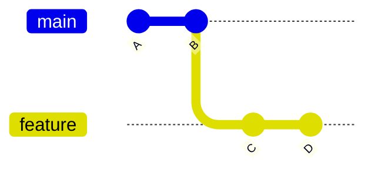
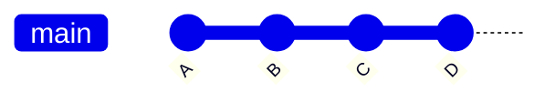
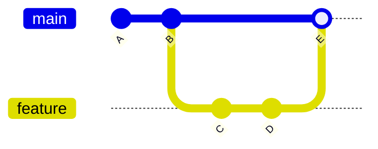
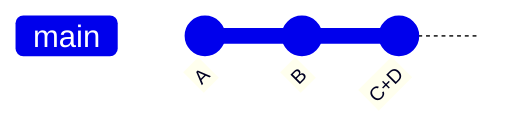

## 단계 5: 브랜치로 작업하기

게임이 추적되고 있으니, 작동하는 버전으로 쉽게 돌아갈 수 있다는 것을 알고 있습니다. 그리고 히스토리에 커밋하는 정확한 변경 사항을 볼 수 있으므로, 관련 없는 내용이 포함되지 않을 것입니다.

하지만 이제 더 많은 질문이 생깁니다! 😱

"지저분한 히스토리를 어떻게 방지하지?"

"미완성 작업으로 인해 히스토리에 작동하지 않는 버전이 남는 것을 어떻게 피하지?"

"여러 기능/수정 사항을 동시에 작업해야 하면 어떻게 하지?"

### 📖 이론: 브랜치 이해하기

Git의 브랜치는 특정 커밋을 가리키는 가벼운 포인터(라벨과 같은)입니다. 이를 통해 원본에 영향을 주지 않고 종속된 버전에서 작업할 수 있어, 병렬 기능 개발과 협업에 유용합니다.

핵심 개념:

- **`main` 브랜치**: 보통 신뢰할 수 있는 작동 버전이자 첫 번째 브랜치입니다. (역사적으로 `master`라고 불렸습니다)
- **기능 브랜치(Feature Branch)**: 신뢰할 수 있는 버전에 영향을 주지 않고 개발할 수 있는 안전한 격리 공간입니다.
- **머지(Merging)**: 다른 브랜치의 변경 사항을 합치는 것입니다.

### 브랜치를 어떻게 합치나요?

커밋을 정리하는 여러 전략이 있습니다. 보통 조직화, 투명성, 추적 가능성의 다양한 스타일을 위한 것입니다. 가장 일반적인 것들을 소개합니다.

**Fast-forward 머지**: 자식 브랜치의 새 커밋을 부모 브랜치 위로 이동합니다.

<div align="center">

**이전:** 원본



**이후:** Fast Forward 머지



</div>

**머지 커밋**: 변경 사항을 부모 브랜치에 하나의 새 커밋으로 적용합니다. 추적 가능성을 위해 자식 브랜치를 네트워크에 남깁니다.

<div align="center">

**이전:** 원본


**이후:** 머지 커밋



</div>

**스쿼시 머지**: 한 브랜치의 커밋들을 다른 브랜치에 하나의 새 커밋으로 압축합니다.

<div align="center">

**이전:** 원본


**이후:** 스쿼시 커밋



</div>

### 중요한 Git 명령어는 무엇인가요?

- `git branch my-new-feature` - 현재 브랜치에서 새 브랜치를 시작합니다.
- `git checkout my-new-feature` - 저장소 히스토리의 다른 버전으로 작업 디렉토리를 변경합니다.
- `git merge` - 한 브랜치의 커밋을 다른 브랜치에 적용합니다. (기본값: Fast forward 머지)

<!-- > [!TIP]
> `git reset --soft HEAD~1`로 마지막 커밋을 간단히 "되돌리기"할 수 있습니다. VS Code에서는 명령 팔레트에서 `Undo Last Commit`을 검색하세요. -->

> [!TIP]
> Git 2.23에서는 브랜치 관리를 단순화하기 위해 `git switch` 명령어가 도입되었습니다. 앞으로 더 많이 사용되는 것을 볼 수 있을 것입니다.

<!-- Since Git 2.23 -->
<!-- `git switch --create <branch name>` -->
<!-- `git switch branch-name` -->

### ⌨️ 활동 1: 브랜치에 커밋하기 (CLI 사용)

브랜치를 시작하고 변경 사항을 커밋하는 연습을 해 봅시다.

1. 시작하기 전에 히스토리가 어떻게 생겼는지 확인합시다. 완벽하게 선형인 것을 확인합니다 (아직 브랜치가 없습니다).

   ```bash
   git log --all --graph --oneline
   ```

   

1. 새 브랜치를 생성하고 전환합니다.

   ```bash
   git branch fix-incomplete-high-score
   git checkout fix-incomplete-high-score
   ```

1. 사용 가능한 브랜치 목록을 표시합니다.

   ```bash
   git branch --list
   ```

   

1. `index.js`를 열어 최고 점수 기능을 수정합니다.

1. `41번째 줄`에 최고 점수 변수를 추가하고 커밋합니다.

   ```js
   let highScore = 0;
   ```

   ```bash
   git add src/index.js
   git commit -m "Add new variable for tracking high score"
   ```

1. `61번째 줄`에 로컬 스토리지에서 점수를 불러오는 코드를 추가하고 커밋합니다.

   ```js
   // Load high score from localStorage
   highScore = parseInt(localStorage.getItem("stackOverflownHighScore")) || 0;
   document.getElementById("high-score").textContent = highScore;
   ```

   ```bash
   git add src/index.js
   git commit -m "Add loading of stored high score"
   ```

1. `313번째 줄`에서 `updateScore` 함수를 최고 점수를 추적하도록 교체한 다음 커밋합니다.

   ```js
   function updateScore() {
     document.getElementById("score").textContent = score;

     // Update high score if current score exceeds it
     if (score > highScore) {
       highScore = score;
       document.getElementById("high-score").textContent = highScore;
       localStorage.setItem("stackOverflownHighScore", highScore);
     }
   }
   ```

   ```bash
   git add src/index.js
   git commit -m "Add logic to keep track of highest score"
   ```

1. 히스토리 그래프를 다시 확인합니다. 기능 브랜치가 `main` 브랜치보다 3개의 커밋이 더 많고, 기능 브랜치에 `HEAD`가 표시되어 현재 버전임을 나타냅니다.

   ```bash
   git log --all --graph --oneline
   ```

   

1. `main` 브랜치로 다시 전환합니다.

   ```bash
   git checkout main
   ```

1. 새 기능을 머지합니다.

   > 🪧 **참고:** 학습을 위해 "not fast forward" 옵션을 사용하여 브랜치가 히스토리에 보이도록 합니다. 시각적 다이어그램이 더 흥미롭게 보일 것입니다.

   ```bash
   git merge --no-ff fix-incomplete-high-score -m "Fix high score tracker"
   ```

   

1. 히스토리 그래프를 다시 확인합니다. 머지된 병렬 브랜치를 확인합니다.

   ```bash
   git log --all --graph --oneline
   ```

   

1. 기능 브랜치의 포인터/라벨을 제거합니다. 이미 머지되었으므로 더 이상 필요하지 않습니다.

   ```bash
   git branch --delete fix-incomplete-high-score
   ```

   > 🪧 **참고**: 이것은 브랜치 내용을 삭제하는 것이 아니라 참조에 사용되는 이름만 삭제합니다.

### ⌨️ 활동 2: 브랜치에 커밋하기 (VS Code 사용)

1. 왼쪽 탐색에서 **Source Control** 탭을 엽니다. **Graph** 패널이 여전히 표시되어 있는지 확인합니다 (단계 3에서 설정). 변경 사항을 적용하면서 업데이트되는 것을 관찰합시다.

1. 하단 상태 바 왼쪽에서 브랜치 이름 `main`을 클릭합니다. 옵션이 있는 메뉴가 나타납니다.

   <br/>

1. **Create new branch...** 옵션을 선택하고 아래 이름을 사용합니다.

   

   ```txt
   add-level-counter
   ```

   

1. `index.html`을 엽니다. `21번째 줄`에 현재 레벨을 표시하는 새 요소를 추가한 다음 변경 사항을 커밋합니다.

   ```diff
   <h3>Level</h3>
   <div class="score" id="level">1</div>
   ```

   커밋 메시지

   ```bash
   Add element to display current level
   ```

1. `index.js`를 열어 레벨 카운터를 추가합니다.

1. `42번째 줄`에 레벨 추적을 위한 변수 2개를 추가한 다음 변경 사항을 커밋합니다.

   ```js
   let level = 1;
   let patternsCleared = 0;
   ```

   커밋 메시지

   ```bash
   Add variables for level and clear counter
   ```

1. `273번째 줄`에서 `checkPatternMatch` 메서드를 다음으로 교체한 다음 변경 사항을 커밋합니다.

   ```js
   function checkPatternMatch() {
     for (let startRow = 0; startRow <= ROWS - PATTERN_SIZE; startRow++) {
       for (let startCol = 0; startCol <= COLS - PATTERN_SIZE; startCol++) {
         if (matchesPattern(startRow, startCol)) {
           clearPattern(startRow, startCol);
           score += 100;
           patternsCleared++;
           if (patternsCleared % 5 === 0) {
             level++;
             dropInterval = Math.max(200, 1000 - (level - 1) * 100);
             document.getElementById("level").textContent = level;
           }
           updateScore();
           setNewTargetPattern();
           return;
         }
       }
     }
   }
   ```

   커밋 메시지

   ```bash
   Add logic to calculate level
   ```

1. **Graph** 패널이 전체 히스토리를 보여주는 것을 확인합니다: 새 커밋, 이전 브랜치, 그리고 원래 커밋들.

   

1. 머지를 준비하기 위해, 브랜치 이름을 다시 클릭하고 `main` 브랜치를 선택합니다.

   <br/>

   

1. 점 세 개 메뉴(`...`)를 클릭한 다음 `Branch`를 선택하고 `Merge...`를 선택합니다. 일반적인 **Fast Forward** 스타일 머지가 수행된 것을 확인합니다.

   <br/>

   <br/>

   

1. 점 세 개 메뉴(`...`)를 클릭한 다음 `Branch`를 선택하고 `Delete Branch...`를 선택합니다.

   <br/>

   

1. 두 브랜치가 모두 머지되면, Mona가 이미 여러분의 작업을 확인하고 있을 것입니다. 잠시 기다리며 댓글을 확인하세요. 진행 상황과 다음 단계가 표시됩니다.

<details>
<summary>문제가 있나요? 🤷</summary><br/>

- 브랜치 이름에 오타가 있으면 `git branch --move old-name new-name`으로 이름을 변경할 수 있습니다.

</details>
